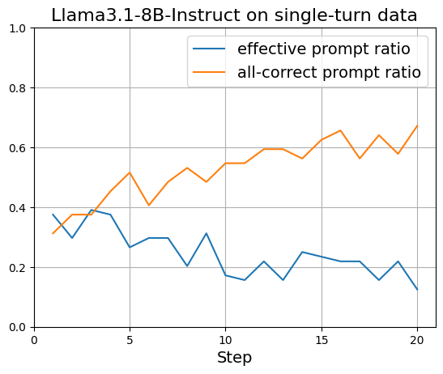
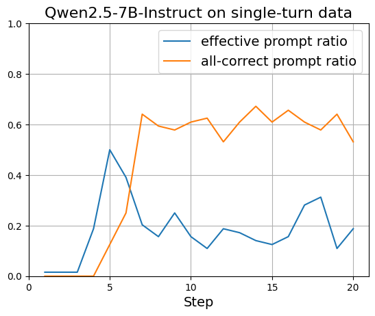
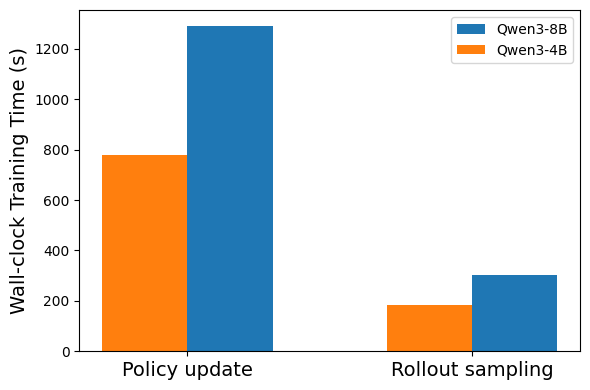

  
  

  Fig. 1: Ratio of zero-variance vs. non-zero-variance prompts during RL training of Llama3.1-8B-Instruct and Qwen2.5-7B-Instruct on the single-turn tool-calling dataset on the first 20 steps with a batchsize of 64. Blue: ratio of prompts whose rollout rewards exhibit variance (i.e., useful learning signal). Orange: ratio of prompts with all rollouts achieving the maximum reward. 

  

  Fig. 2: Wall-clock training time breakdown for Qwen3-4B and Qwen3-8B on multi-turn tool-calling. The high computational cost during policy updates persists as model size increases. 

